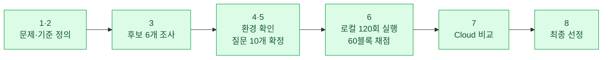
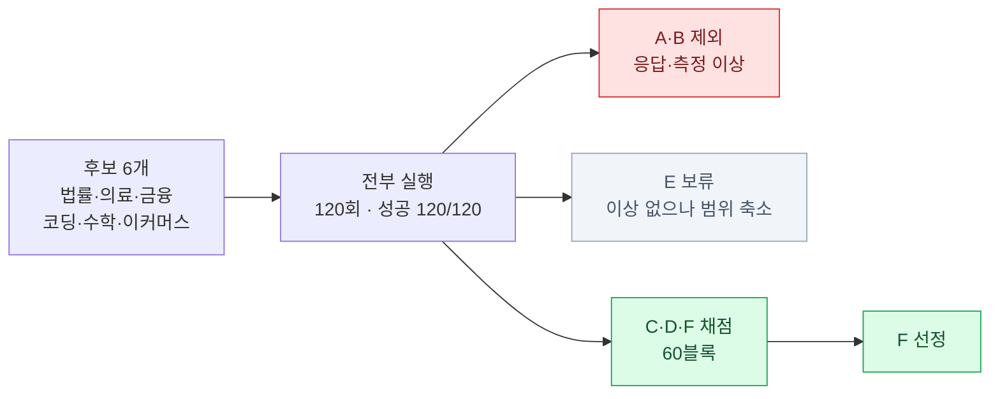

# 이커머스 고객 문의 대응 로컬 LLM 비교·선정

상품 문의가 폭주해 업무가 마비된 쇼핑몰에서, **고객 문의와 셀러 업무 질문에 자동으로
답할 로컬 LLM을 고르는 프로젝트**다. 도메인이 서로 다른 오픈소스 모델 6개를 같은 조건으로
120회 돌리고, 같은 기준으로 채점해 1개를 선정했다.

> ## 결론 — **Model F (이커머스 특화 `sam-1-base`)**
>
> 필수 통과 조건 7개를 모두 충족한 **유일한** 후보다. 품질 평균 3.65로 통과선(3.5)을 넘겼고,
> 상품 정보가 없는 위험한 문의에서 다른 후보보다 **41~84%** 앞섰다.
> 다만 통과 여유가 얇아 **전면 자동화는 권장하지 않는다.**

| | |
|---|---|
| 수행 | 개인 · 5일 |
| 실행 환경 | Windows 11 · RTX 5060 Laptop (VRAM 8GB) · Ollama |
| 실험량 | 로컬 6개 × 10문항 × 2회 = **120회** + Cloud 5회 |
| 채점 | 비교 대상 3개 × 60블록 (재검토 포함) |
| 최종 산출물 | **[docs/deliverables.md](docs/deliverables.md)** |



---

## 1. 무엇을 풀려고 했나

| | |
|---|---|
| 상황 | 상품별 고객 문의 대응 시스템 운영 중 — **문의 폭주로 업무 마비** |
| 사용자 | 일반 쇼핑몰 고객 · 상품을 운영하는 셀러 |
| 태스크 | 고객 문의 5문항 + 셀러 업무 5문항 질의응답 |
| 중요한 것 | 한국어 성능 · 응답 속도 · **데이터 보안** |
| 보안이 중요한 이유 | 고객 문의에 주문번호·연락처·배송지 같은 **개인정보가 섞여 들어올 수 있다** → 로컬 우선 처리의 근거 |
| 장비 | 노트북 1대 · VRAM 8GB |

원문: [docs/steps/step01.md](docs/steps/step01.md)

## 2. 어떻게 고를지 먼저 정했다

결과를 보고 기준을 맞추지 않으려고, **실험 전에** 통과 조건과 우선순위를 확정했다.

**필수 통과 조건** — 하나라도 못 넘기면 탈락

| # | 조건 | 판정 근거 |
|---|---|---|
| 1 | 한국어 Chat/QA 가능 | 채점 기준 C 점수 |
| 2 | Ollama 실행 가능 | 호출 성공 여부 |
| 3 | 현재 PC에서 안정 실행 | OOM·중단 없이 완주 |
| 4 | 상업적 활용 가능 License | Model Card 원문 |
| 5 | 이커머스 질의 처리 가능한 Context | 문서상 최대 Context |
| 6 | **품질 평균 3.5 이상** (1~5점) | 채점 결과 |
| 7 | 평균 응답 5초 이내 | `elapsed_sec` 실측 |

**선호 우선순위** — 통과한 후보끼리 순위를 가른다

| 순위 | 항목 | 채점 기준 | 왜 이 순서인가 |
|---|---|---|---|
| 1 | 사실 정확성·추정 방지 | E | 고객에게 잘못된 안내가 나가는 게 가장 큰 위험 |
| 2 | 질문 의도·핵심 요구 충족 | A + B | 묻는 것에 답하고 다음 행동을 줘야 함 |
| 3 | 한국어 실무 활용성 | C | 바로 고객 응대에 쓸 수 있어야 함 |
| 4 | Instruction Following | D | 형식·제한 조건 준수 |
| 5 | 실행 효율성 | 실측 | 생성 속도 · VRAM · 반복 안정성 |

> **두 축은 다른 판정이다.** 필수 조건은 Pass/Fail, 우선순위는 통과자 간 순위다.

<details>
<summary>기준을 나중에 손댄 두 가지 (시점 공개)</summary>

- **조건 7(응답 속도)** — STEP 1부터 "속도 중요"는 있었으나 필수 조건화가 늦었다.
  STEP 8 검토 중 추가했고, 5초 통과선은 **실측값을 이미 아는 상태에서** 정했다.
  세 후보 모두 통과해 변별력은 없었다.
- **선호 우선순위 순서** — 채점 도중 1순위를 `사실 정확성`으로 올렸다.
  필수 조건·통과선·채점 기준·질문 세트는 바꾸지 않아 Pass/Fail에 영향이 없다.

</details>

원문: [docs/steps/step02.md](docs/steps/step02.md)

## 3. 후보 6개를 돌리고 3개로 좁혔다

**도메인이 서로 다른 모델**을 모아, 이커머스 질의를 어떻게 처리하는지 비교했다.
크기(7~8B)와 양자화(Q4_K_M)를 통일해 **차이가 도메인 때문인지 규모 때문인지 섞이지 않게** 했다.



**호출은 6개 모두 20/20 성공했다.** 뺀 것은 호출 실패가 아니라 응답·측정에서 문제가 보였기 때문이다.

| 라벨 | 관찰된 문제 | 판단 |
|---|---|---|
| A 법률 | 20/20 출력 한도까지 생성 · 특수토큰 노출 12/20 · 평균 12.45초 | 답이 언제 끝나는지 모델이 판단 못해 **정상 조건 채점 불가** |
| B 의료·바이오 | 20회 중 **14회 통계 필드 결측** | 다른 모델과 **같은 n으로 비교 불가** |
| E 수학 | **문제 없음** (20/20 `stop`, 결측 0) | 제외 사유 아님. 범위를 좁히려 이번 회차에서만 뺌 |

제외한 세 모델의 **실행 기록 60회분도 그대로 남겼다** — 제외 근거 자체가 산출물이다.

| 비교 대상 | 모델 | Architecture | License |
|---|---|---|---|
| C 금융 | BCCard-Llama-3.1-Kor-Finance-8B | Llama 3.1 8B | Meta Llama 3 Community |
| D 코딩 | Qwen2.5-Coder-7B-Instruct | Qwen2.5 | Apache-2.0 |
| F 이커머스 | sam-1-base | Qwen2.5-7B-Instruct 기반 | Apache-2.0 |

> **F는 교체된 후보다.** 당초 POLAR-14B였으나 GGUF 변환본이 응답 포맷 오류(500)로
> 호출 자체가 불가능해 같은 도메인의 sam-1-base로 바꿨다.

제원·출처 전체: [`tables/model_comparison.md`](data/derived/tables/model_comparison.md) · 조사 원문: [step03.md](docs/steps/step03.md)

## 4. 같은 조건으로 120회 돌렸다

**질문 10개** (정상 6 / 경계 2 / 정보 부족 2), 고객 문의 5 + 셀러 업무 5.
Cloud 비교용 5문항은 **결과를 보기 전에** 골라 설정 파일에 박아뒀다.

| 설정 | 값 | 이유 |
|---|---|---|
| `temperature` | 0 | 모델 차이인지 운인지 섞이면 비교가 성립하지 않는다 |
| `num_predict` | 768 | 긴 답변도 잘리지 않는 선, 무한 생성 방지 |
| `num_ctx` | 4096 | 6개 모델 조건 통일 |
| 반복 | 2회 | 한 번의 운을 배제 |
| 워밍업 | 모델당 1회 | 첫 호출의 로딩 시간을 본 실험에서 걷어낸다 |

**성능 실측** — 호출 60/60 성공, 측정 결측 0건

| 지표 | C (금융) | D (코딩) | F (이커머스) |
|---|---|---|---|
| 평균 응답 시간 | **2.89s** | 4.05s | 3.33s |
| 평균 생성 속도 | 61.13 t/s | **66.97 t/s** | 61.58 t/s |
| 평균 출력 토큰 | **158.4** | 252.0 | 187.1 |
| VRAM (관측 시점) | 5,027 MiB | **4,528 MiB** | **4,528 MiB** |
| CPU/GPU 적재 | 100% GPU | 100% GPU | 100% GPU |

> 워밍업 분리가 실제로 동작했다 — 워밍업이 모델 로딩(약 4.6초)을 흡수해
> 본 실험 120회의 평균 로딩 시간이 **0.2초**다.

설정 원문: [step05.md](docs/steps/step05.md) · 전체 측정표: [step06.md](docs/steps/step06.md)

## 5. 60블록을 같은 기준으로 채점했다

1~5점, 문항마다 해당하는 기준만 적용했다. 모든 점수에 **응답의 어느 부분 때문인지 근거**를 달고
전건 재검토했다.

**필수 조건 6 판정**

| | C (금융) | D (코딩) | F (이커머스) |
|---|---|---|---|
| 품질 평균 | 2.31 | 3.00 | **3.65** |
| 조건 6 (3.5 이상) | Fail | Fail | **Pass** |

**기준별** — `n`은 그 기준으로 매긴 모델당 점수 개수다 (출제 문항 × 2회)

| 평가 기준 | 출제 문항 | C | D | F | n |
|---|---|---|---|---|---|
| A 답변 적합성 | 10문항 | 1.70 | 3.10 | **3.70** | 20 |
| B 논리성/실용성 | 9문항 | 1.78 | 2.83 | **3.28** | 18 |
| C 한국어 표현 | 10문항 | 3.35 | 3.15 | **4.15** | 20 |
| D 지시사항 준수 | 3문항 | 3.67 | 3.67 | 3.67 | 6 |
| E 정보 부족 대응 | 4문항 | 1.38 | 2.25 | **3.12** | 8 |

**여기서 이 프로젝트의 핵심 발견이 나온다.**

| 사례 유형 | C | D | F | F − D |
|---|---|---|---|---|
| 정상 (n=12) | 2.79 | 3.62 | **3.97** | +9.7% |
| 경계 (n=4) | 1.62 | 2.56 | **3.62** | +41.4% |
| 정보 부족 (n=4) | 1.67 | 1.67 | **3.08** | **+84.4%** |

일상적인 문의에서는 세 모델이 비슷하다. **차이는 상품 정보가 없는 문의에서 벌어진다** —
C·D는 나란히 1.67로 무너지고 F만 3점대를 지킨다. 이커머스 자동 응대에서 실제 사고가
나는 지점이 바로 여기이고, STEP 2에서 사실 정확성을 1순위로 둔 이유다.

> 비교 대상 3개 중 이커머스 도메인과 일치하는 후보는 F 하나뿐이라 "F가 이긴다"는
> 방향은 어느 정도 예상 가능했다. 이 실험이 실제로 보여준 것은 방향이 아니라
> **격차가 어디에 몰려 있는가**다 — 정상 문의 9.7%에서 정보 부족 문의 84.4%까지,
> 도메인 라벨만으로는 알 수 없던 크기다.

**회차 간 일관성** — F가 가장 안정적이다

| | Run 1 | Run 2 | 편차 |
|---|---|---|---|
| C | 2.28 | 2.38 | 0.10 |
| D | 2.99 | 3.04 | 0.05 |
| F | 3.73 | 3.72 | **0.01** |

채점 원본: [eval-results.md](docs/eval-results.md) · 집계: [`tables/local_summary.md`](data/derived/tables/local_summary.md)

## 6. Cloud와 비교했다

공통 5문항을 Cloud(GPT LUNA)에 **각 1회** 적용했다. 로컬은 같은 문항을 2회 돌렸으므로
**반복 수가 다르고**, 로컬의 좋은 회차만 골라 비교하지 않았다.

| | C | D | F | **Cloud** |
|---|---|---|---|---|
| 품질 평균 (5문항) | 2.32 | 3.00 | 3.50 | **4.53** |
| 평균 응답 시간 | 3.40s | 4.77s | **3.86s** | 6.97s |
| 생성 속도 | 62.25 t/s | 66.36 t/s | 62.89 t/s | **계산 불가** |
| 종료 상태 | stop 10 | stop 10 | stop 10 | completed 4 / **incomplete 1** |

**Cloud가 품질에서 앞섰다.** 다만 세 가지를 함께 봐야 한다.

- Cloud 응답 시간에는 **네트워크 왕복이 포함**되고 내부 생성 시간이 없어 tokens/s를 계산하지 않았다
- Cloud 비용은 추정 **$0.0029544** (5회 합산, 입력 186 / 출력 2,431 토큰) — **실제 청구액이 아니다**
- Q10에서는 Cloud도 4.00으로 최저였다. **어느 모델도 "어떤 상품인지" 되묻지 않았다**
- **품질만으로 Cloud를 고를 수 없다** — 문의 원문이 외부 API로 나가는데, 그 안에 개인정보가
  섞일 수 있다 (STEP 1 보안 제약)

보안·인프라·운영·커스터마이징 비교까지: [step07.md](docs/steps/step07.md)

## 7. 최종 선정 — Model F

필수 조건 7개 중 **6개는 세 후보가 모두 통과**했다. 실제로 후보를 가른 것은 조건 6 하나다.

| # | 조건 | C | D | F |
|---|---|---|---|---|
| 1~5, 7 | 한국어 · Ollama · 안정 실행 · License · Context · 속도 | Pass | Pass | Pass |
| 6 | **품질 평균 3.5 이상** | **Fail 2.31** | **Fail 3.00** | **Pass 3.65** |
| | **최종** | **Fail** | **Fail** | **Pass** |

**집계 방식을 바꿔도 결론이 같다.**

| 집계 방식 | C | D | F |
|---|---|---|---|
| 점수 전체 평균 (공식) | 2.31 | 3.00 | **3.65** |
| 기준 A~E 동일 가중 | 2.38 | 3.00 | **3.58** |
| 문항 10개 동일 가중 | 2.33 | 3.02 | **3.73** |

**선정 근거 요약**

1. 필수 조건을 전부 통과한 **유일한 후보**
2. 최우선 기준 E에서 **유일하게 3점대** — 위험 구간에서 D 대비 41~84% 우위
3. **D를 품질·응답 시간·출력 토큰·VRAM 전 축에서 앞선다** (생성 속도만 8.8% 열세)
4. 토큰 효율 최고 — D보다 토큰 25.8% 적게 쓰고 품질 21.7% 높다
5. 회차 간 편차 0.01로 재현성 최고, 라이선스도 Apache-2.0

> **도메인 특화 가설이 결과로 확인됐다** — 이커머스 태스크에서 이커머스 특화가 1위,
> 코딩이 2위, 금융이 최하위였다. 금융도 정확성이 중요한 분야인데 최하위라는 점은
> 도메인 특화가 다른 도메인으로 잘 전이되지 않음을 보여준다.
>
> 다만 비교 대상 3개 중 도메인이 일치하는 후보가 F 하나뿐이라 이 순위 자체는 어느
> 정도 예견됐다. 실험으로 새로 확인한 것은 **격차의 크기와 위치** — 정상 사례에서는
> 9.7%p 차이지만 정보 부족 사례에서는 84.4%p까지 벌어진다는 사실이다.

선정 근거 전문: [step08.md](docs/steps/step08.md)

## 8. 한계와 운영 권고

**이 결과를 어디까지 믿을 수 있나**

| 한계 | 내용 |
|---|---|
| 평가셋 | 질문 10개 × 2회. **1순위 근거 E가 8건, 4순위 D가 6건** — 가장 중요한 기준의 표본이 가장 작다 |
| 입력 범위 | 프롬프트에 상품 상세페이지를 넣지 않았다. **제공된 정보를 정확히 인용하는 능력은 미검증** |
| 장비 | VRAM 8GB 노트북 · Q4_K_M 고정. 다른 환경에서는 수치가 달라진다 |
| Cloud | 질문당 1회(n=1)라 실행 간 변동을 확인하지 못했다 |
| 선정 모델 언어 | `sam-1-base` 모델 카드는 **English only**를 명시한다. 실측 한국어 4.15는 base(Qwen2.5)의 다국어 능력을 상속한 것으로 보이며, **제조사 보증 범위가 아니다** |

**운영 권고** — Cloud가 품질에서 앞섰지만 **고객 문의 원문을 외부로 내보내는 경로**다.
STEP 1이 보안을 중요 제약으로 정의했으므로, 문의 처리는 전부 로컬에 둔다.

| 문의 유형 | 처리 위치 | 근거 |
|---|---|---|
| 일반 상품 문의 | **Local F** | F 3.97로 충분, API 과금 0, 응답 3.86s, 문의가 외부로 안 나감 |
| 경계 사례 | **Local F + 사람 검수** | 3.62로 대응 가능하나 오답 시 영향이 크다 |
| 정보 부족 문의 | **상담원 연결** | F의 최약점(3.08)이지만, 고객이 주문·배송 정보를 덧붙이기 쉬워 **개인정보 노출 위험이 가장 큰 구간** |
| 대량·상시 트래픽 | **Local F** | Cloud는 호출당 과금이 누적되고 전송량도 늘어난다 |

**Cloud는 개인정보가 들어가지 않는 작업에만** 쓴다 — 셀러용 FAQ 초안, 상품 설명 문구
다듬기 등. 그 경우에도 제공자의 데이터 처리·보관 정책을 먼저 확인한다.

**도입 판단: 조건부 가능.** 통과 여유가 +0.15(기준 동일 가중 시 +0.08)로 얇고
1순위 기준 E가 3.12다. "확인되지 않은 정보는 단정하지 않는다"를 프롬프트에 명시하고,
확인 불가 시 상담원 전환 경로를 두는 안전장치가 필요하다.

---

# 산출물

| | 산출물 | 위치 |
|---|---|---|
| 1 | GitHub Repository | 이 저장소 |
| 2 | Model Comparison Table | [`tables/model_comparison.md`](data/derived/tables/model_comparison.md) |
| 3 | Test / Benchmark 결과 | `data/raw/*/runs.jsonl` · [eval-results.md](docs/eval-results.md) · [`tables/local_summary.md`](data/derived/tables/local_summary.md) |
| 4 | Local vs Cloud 비교 | [step07.md](docs/steps/step07.md) · [cloud-compare.md](docs/cloud-compare.md) |
| 5 | 최종 Model Selection Report | [step08.md](docs/steps/step08.md) |

**발제문 7·8장 대응 제출 문서: [docs/deliverables.md](docs/deliverables.md)**

---

# 재현 방법

```bash
cd project1-python-start
uv sync
uv run python 10_run.py      # MODEL 을 A~F 로 바꿔 가며 실행
uv run python 12_read.py     # 채점표·응답 모음 생성
uv run python 11_finish.py   # 검사 → 집계 → 표 생성
uv run python 13_cloud.py    # STEP 7 Cloud (API 키는 실행 시 입력)
```

`uv run` 을 쓴다. 그냥 `python` 으로 돌리면 venv 밖 인터프리터가 잡힌다.
중단해도 되고, 다시 실행하면 **이미 기록된 회차는 건너뛴다.**

설정값 의미·문제 상황별 대처: [docs/usage.md](docs/usage.md)

## 파일 위치

| 구분 | 경로 | 성격 |
|---|---|---|
| 입력 | `data/config/*.json` | 1회 확정 후 고정 (모델·질문·실행 조건) |
| 입력 | `data/env/environment.json` | 실행 환경·모델 제원 (대부분 자동 수집) |
| 원본 기록 | `data/raw/local/runs.jsonl` (126건) · `cloud/runs.jsonl` (5건) | **append 전용** |
| 채점 입력면 | `docs/eval-results.md` · `docs/cloud-compare.md` | 사람이 직접 점수·근거를 적는 곳 |
| 생성물 | `data/derived/**` | 언제든 재생성 — **직접 고치지 않는다** |
| 문서 | `docs/steps/step01~08.md` | 단계별 작업 기록 |
| 코드 | `project1-python-start/src/evalkit/` | 실행·집계·검증 |

저장소에 **없는 것**: 모델 가중치 · API 키 · `.venv`

수치가 어느 실행에서 나왔는지 추적: `aggregator.trace("F_Q01_r1")` — [docs/data-flow.md](docs/data-flow.md)

## 기록 규칙

코드가 강제하고 `validator` 가 검사한다.

1. 측정하지 못한 값은 `0` 이 아니라 `null` + 사유
2. **호출 실패 / 측정 누락 / 품질 미달은 서로 다른 축** — 한 칸에 섞지 않는다
3. 워밍업·재시도는 기록하되 본 실험 집계에서 제외
4. `run_id` 중복 시 건너뛰고 경고, 원본은 append 모드로만 연다
5. 집계값은 `source_run_ids` 로 원본 회차까지 역추적된다

**측정값 해석 주의**

- `elapsed_sec` 는 전체 응답 시간이며 **TTFT가 아니다**
- `size_vram` 은 관측 시점 값이며 **최대 VRAM이 아니다**
- `processor` 는 CPU/GPU 적재 상태이며 **GPU 이용률이 아니다**
- **tokens/s 만으로 품질이나 체감 속도를 판단하지 않는다** — 이번에도 가장 빠른 모델이 품질 1위가 아니었다

**보안** — API 키는 실행 시점에 입력받거나 환경변수에서 읽고 **파일·기록·로그 어디에도 남기지 않는다.**
Cloud 호출은 자동 재시도하지 않는다(`max_retries=0`). 공개·가상 데이터만 사용한다.
