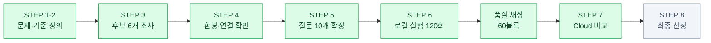
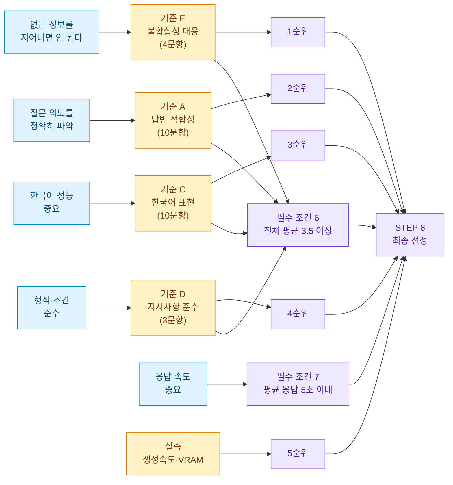
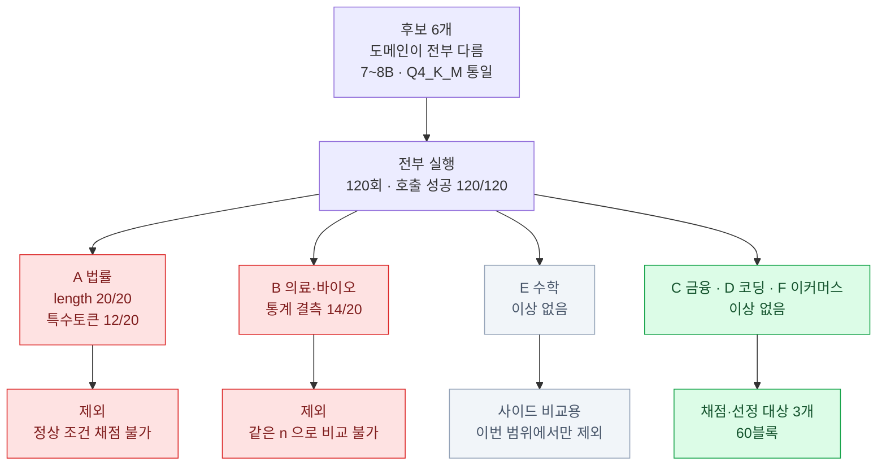
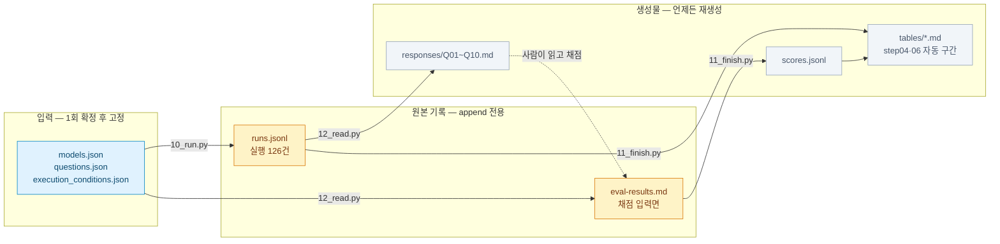

# 이커머스 고객 문의 대응 로컬 LLM 비교·선정

상품 상세페이지 기반 고객 문의에 답변할 **로컬 LLM 후보를 비교하고 1개를 선정**하는 프로젝트다.

| | |
|---|---|
| 수행 형태 | 개인 |
| 실행 환경 | Windows 11 · RTX 5060 Laptop (VRAM 8GB) · Ollama |
| 실행 완료 | 로컬 6개 모델 × 10문항 × 2회 = **120회** |
| 품질 채점 | 3개 모델 × 10문항 × 2회 = **60블록 완료** (재검토 포함) |
| 조건 6 판정 | C Fail 2.31 · D Fail 3.00 · **F Pass 3.65** |
| STEP 7 | Cloud 5/5 실행·채점 완료 (`temperature=0`) — Cloud 4.53 · F 3.50 · D 3.00 · C 2.32 |
| 진행 상태 | **STEP 1~7 완료 · STEP 8 최종 선정만 남음** |



<sub>초록 = 완료 · 회색 = 예정</sub>

---

## 1. 문제 정의 — 무엇을 풀려고 하는가

상품별 고객 문의에 답변하는 시스템을 운영 중인데 **문의 폭주로 업무가 마비**됐다.
정확히 답변할 수 있는 자동 응답 모델이 필요하다.

| 항목 | 내용 |
|---|---|
| 사용 사례 | 상품 상세페이지 정보 기반 고객 문의 자동 응답 |
| 사용자 | 일반 쇼핑몰 고객 |
| 태스크 | 상품 관련 질의응답 + 셀러 업무 질문 |
| 한국어 성능 | **중요** |
| 응답 속도 | **중요** |
| 데이터 보안 | 중요하지 않음 → STEP 7 Local–Cloud 판단 근거로 재사용 |

원문: [docs/steps/step01.md](docs/steps/step01.md)

## 2. 선정 기준 — 실험 전에 확정

**선정 목표** — 상품 상세페이지에 제공된 정보를 바탕으로 일반 쇼핑몰 고객의
한국어 질문에 정확하고 신속하게 답할 수 있는 로컬 모델을 고른다.
정보가 없거나 불확실하면 내용을 만들어 답하지 않고 확인이 필요하다고 안내해야 한다.

아래 필수 조건과 전체 평균 3.5 통과선은 **실험 시작 전에** 정했다.
실제 자동 응답에 사용할 수 있는지는 실험 결과를 바탕으로 별도 검토한다.

**모델 선정 기준** — 모델 계열이나 벤치마크 성능보다 **서로 다른 도메인으로
Fine-tuning 된 모델의 실제 응답 특성 비교**를 우선했다.

| 구분 | 조건 |
|---|---|
| **주요 기준** | 특정 도메인에 명확하게 특화된 모델일 것 |
| **주요 기준** | 서로 다른 도메인을 대표할 것 |
| 보조 조건 | 로컬 환경(8GB VRAM · Ollama GGUF)에서 실행 가능할 것 |
| 보조 조건 | 7~8B 급으로 실행 규모가 크게 벗어나지 않을 것 |
| 보조 조건 | 동일한 Q4_K_M 양자화 조건으로 비교 가능할 것 |
| 보조 조건 | Context Length 4,096 이상 (상세페이지 + 질문 + 답변) |

보조 조건은 **비교 조건을 맞추기 위한 것**이다. 크기와 양자화가 다르면
응답 차이가 도메인 특화 때문인지 모델 규모 때문인지 구분되지 않는다.

**필수 통과 조건 (Pass/Fail)** — 판정 대상은 비교 대상 3개

| # | 조건 | 확인 시점 |
|---|---|---|
| 1 | 한국어 Chat/QA 가능 | STEP 6 |
| 2 | Ollama 실행 가능 | STEP 3~4 |
| 3 | 현재 PC에서 안정 실행 | STEP 4, 6 |
| 4 | 상업적 활용 가능 License | STEP 3 |
| 5 | 이커머스 질의 처리 가능한 Context Length | STEP 3, 6 |
| 6 | **전체 평균 3.5 이상** (1~5점) | STEP 5~6 |
| 7 | 응답 속도 — **평균 전체 응답 시간 5초 이내** | STEP 8 |

조건 1~5, 7은 모델 문서 또는 실행 기록으로 근거를 확인한다. 근거가 부족하면
`Pass`로 추정하지 않고 **미확인**으로 표시한다. 조건 3의 실행 기록은 이번
실험 환경에서의 안정성을 판단하는 근거이며 장시간 운영 안정성을 뜻하지 않는다.
조건 5는 문서상 최대 Context와 실험에서 설정한 Context를 구분해 확인한다.

조건 6 판정은 손으로 계산하지 않는다. 통과선 3.5 는 `questions.json` 의
`score_scale.pass_threshold` 에 값으로 박혀 있고, `11_finish.py` 가 그 값을 읽어
`Pass / Fail` 을 STEP 06 표에 찍는다.
전체 평균은 본 실험에서 채점된 항목별 점수를 모두 합산한 값이며,
사용한 점수 개수 `n`을 함께 적는다.

**조건 7은 실험 전이 아니라 STEP 8 검토 중에 추가했다.** "응답 속도 중요"는
STEP 1부터 있던 요구사항이지만 처음엔 선호 우선순위 5위에만 반영돼 있었다.
5초 통과선은 C·D·F 값(2.89s / 4.05s / 3.33s)을 이미 아는 상태에서 정했으므로
결과를 본 뒤 정한 기준임을 숨기지 않는다. 세 후보 모두 통과해 구분력은 없다.
상세: [step02.md](docs/steps/step02.md).

**선호 우선순위** — 필수 조건을 모두 통과한 후보 사이의 순위를 정한다

| 순위 | 항목 | 채점 기준 |
|---|---|---|
| 1 | **사실 정확성과 추정 방지** — 없는 정보를 지어내지 않는가, 정보 부족을 구분하는가 | E |
| 2 | 질문 의도·핵심 요구사항 충족 — 묻는 것에 답하고 실행 가능한 다음 행동을 주는가 | A + B |
| 3 | 한국어 실무 활용성 — 바로 고객 응대에 쓸 수 있는가 | C |
| 4 | Instruction Following — 형식·제한 조건 준수 | D |
| 5 | 실행 효율성 — 생성 속도 · VRAM · 반복 안정성 | 실측 |

이커머스 고객 응대에서 **없는 정보를 지어내는 것이 가장 큰 위험**이라 사실 정확성을 1순위에 두었다.
5순위는 이미 실측이 끝났다 (5절). 1~4순위는 채점 결과로 정해진다.
평균 응답 시간(전체 응답 시간)은 더 이상 이 순위가 아니라 **필수 조건 7**로 판정한다.

> 1순위의 주축인 기준 E 는 4문항, 4순위의 D 는 3문항에서만 출제된다.
> **가장 중요한 순위의 표본이 가장 작다** — 순위 판단에 이 한계를 함께 적는다.

### 요구사항이 어떻게 판정으로 이어지는가



**필수 조건 6·7은 Pass/Fail**, **우선순위는 통과한 후보 사이의 순위**다. 둘은 다른 판정이다.
조건 7은 STEP 8 검토 중 추가한 조건이라 실험 전 확정은 아니다 (위 표 참조).

**실제 자동 응답 적합성**은 위 Pass/Fail과 별도로 검토한다. 전체 평균뿐 아니라
가장 중요한 정보 부족·불확실성 대응(E) 점수와 확인되지 않은 사실을 단정한
실패 사례를 살핀다. 문제가 남아 있으면 전체 평균이 3.5 이상이어도
검토 후 응답 등으로 사용 범위를 제한한다. 이 검토는 이미 확정한 통과선이나
기존 실험의 조건 6 판정을 소급해서 바꾸지 않는다.

원문: [docs/steps/step02.md](docs/steps/step02.md)

## 3. 후보 모델 — 도메인이 다른 6개를 돌리고 3개로 좁힘

이커머스(F)가 이 프로젝트의 주제 도메인이고, 나머지는 **다른 도메인 특화 모델이
이커머스 질의를 어떻게 처리하는지** 보기 위한 비교군이다.
6개 모두 7~8B · Q4_K_M 으로 조건을 맞췄고 전부 실행했다.
그중 **채점과 최종 선정은 3개**로 한정한다.

| 구분 | 라벨 | 도메인 | 모델 |
|---|---|---|---|
| **비교 대상** | C | 금융 | BCCard-Llama-3.1-Kor-Finance-8B |
| **비교 대상** | D | 코딩 | Qwen2.5-Coder-7B-Instruct |
| **비교 대상** | F | 이커머스 | sam-1-base |
| 제외 | A | 법률 | Llama-3.1-Korean-8B-Instruct-Law |
| 제외 | B | 의료·바이오 | KoBioMed-Llama-3.1-8B-Instruct |
| 사이드 비교용 | E | 수학 | Math-IIO-7B-Instruct |

과제 필수는 로컬 후보 2개이므로 3개는 그 이상이다.

**왜 3개로 좁혔나** — 호출은 6개 모두 20/20 성공했지만, **응답과 측정에서 문제가
관찰된 모델**을 채점 대상에서 뺐다.

| 라벨 | 관찰된 문제 | 판단 |
|---|---|---|
| A | 20/20 회 출력 한도까지 생성(`done_reason=length`) · 12회에서 `<\|im_end\|>` 특수토큰 노출 · 평균 12.45초 | 답변이 언제 끝나는지 모델이 판단하지 못해 **정상 조건에서 채점 불가** |
| B | 20회 중 **14회에서 응답에 통계 필드가 없음** — 속도·토큰 지표를 6회분으로만 산출 | 다른 모델과 **같은 n 으로 비교되지 않음** |
| E | **문제 없음** (20/20 `stop`, 결측 0, 평균 4.74초) | 제외 사유 아님. **추후 사이드 비교 모델** 로 쓸 목적으로 이번 범위에서만 뺌 |



세 모델의 **실행 기록 120회분과 성능 측정값은 지우지 않는다** — 제외 근거도 산출물이다.
상세: [docs/steps/step08.md](docs/steps/step08.md)

제원·License·Model Card 출처: [data/derived/tables/model_comparison.md](data/derived/tables/model_comparison.md)
후보 조사 원문: [docs/steps/step03.md](docs/steps/step03.md)

> **Model F 교체 이력** — 당초 이커머스 후보는 POLAR-14B-v0.5 였으나 GGUF 변환본이
> 응답 포맷 오류(500)로 호출 자체가 불가능했다. 12:43·14:42 두 차례 동일 실패를 확인하고
> 같은 도메인의 sam-1-base 로 교체했다. 삭제한 기록과 사유는
> [docs/steps/step06.md](docs/steps/step06.md) '실행 기록 삭제 이력' 에 남아 있다.

## 4. 실험 설계 — 조건을 어떻게 통제했는가

Local·Cloud의 실제 적용 조건(출력 한도 768토큰), 비교 지표와 보완할 기록 항목은
[실험 조건 및 실행 전 점검표](docs/experiment-conditions.md)에 모았다.

**질문 10개** (정상 6 / 경계 2 / 정보 부족 2), 고객 문의 5 + 셀러 업무 5.
Cloud 비교용 5문항(Q01·Q04·Q06·Q09·Q10)은 **결과를 보기 전에** 선정했다.

**실행 설정** — 6개 모델에 동일 적용

| 설정 | 값 | 이유 |
|---|---|---|
| `temperature` | 0 | 모델 차이인지 운인지 섞이면 비교가 성립하지 않는다 |
| `num_predict` | 768 | 가장 긴 답변도 잘리지 않는 선. 무한 생성 방지 |
| `num_ctx` | 4096 | 6개 모델 기본값이 같아 조건이 동일해진다 |
| `seed` | 0 | 재현성 |
| system prompt | 없음 | 모델마다 처리 방식이 달라 특정 모델에 유리해질 수 있다 |
| 반복 | 2회 | 한 번의 운을 배제 |
| 워밍업 | 모델당 1회 | 첫 호출의 로딩 시간을 본 실험에서 걷어낸다 |

**채점 기준** — 1~5점, 문제마다 해당 기준만 적용

| 코드 | 기준 | 출제 |
|---|---|---|
| A | 답변 적합성 | 10문항 |
| B | 논리성/실용성 | 9문항 |
| C | 한국어 표현 | 10문항 |
| D | 지시사항 준수 | 3문항 |
| E | 정보 부족 / 불확실성 대응 | 4문항 |

질문 원문·기대 결과·감점 요소: [docs/steps/step05.md](docs/steps/step05.md)

## 5. 실행 결과 — 성능 측정 (완료)

**호출 60/60 성공, 측정 결측 0건.**

| 지표 | Model C (금융) | Model D (코딩) | Model F (이커머스) |
|---|---|---|---|
| 호출 성공 / 시도 | 20 / 20 | 20 / 20 | 20 / 20 |
| 평균 응답 시간 | 2.89s | 4.05s | 3.33s |
| 평균 생성 속도 | 61.13 t/s | 66.97 t/s | 61.58 t/s |
| 평균 출력 토큰 | 158.4 | 252.0 | 187.1 |
| VRAM (관측 시점) | 5,027 MiB | 4,528 MiB | 4,528 MiB |
| CPU/GPU 적재 | 100% GPU | 100% GPU | 100% GPU |
| 출력 한도 도달 | 0회 | 0회 | 0회 |

부가 테스트 3개를 포함한 전체 표: [docs/steps/step06.md](docs/steps/step06.md)

> 워밍업 분리가 실제로 동작했다 — 워밍업에서 모델 로딩(약 4.6초)을 흡수해
> 본 실험 120회의 평균 로딩 시간이 0.2초다. 첫 실행 지연과 일반 응답 지연이 섞이지 않았다.

**제외한 3개에서 관찰된 것** (3절의 제외 근거)

| | 결과 |
|---|---|
| A (법률) | 20/20 `done_reason=length` · 특수토큰 노출 12/20 · 평균 12.45초 |
| B (의료·바이오) | 통계 필드 결측 14/20 (`n=6`) · 측정된 6회는 전부 `length` |
| E (수학) | 20/20 `stop` · 결측 0 · 평균 4.74초 — **문제 없음** |

## 6. 품질 채점 결과 — 60/60 완료

**필수 조건 6 판정 (전체 평균 3.5 이상)**

| | Model C (금융) | Model D (코딩) | Model F (이커머스) |
|---|---|---|---|
| 평균 품질 점수 | 2.31 (n=72) | 3.00 (n=72) | **3.65 (n=72)** |
| 조건 6 판정 | Fail | Fail | **Pass** |

**기준별** — 우선순위 1위인 E 에서 F 만 3점대다.

| 평가 기준 | C | D | F | n |
|---|---|---|---|---|
| A 답변 적합성 | 1.70 | 3.10 | **3.70** | 20 |
| B 논리성/실용성 | 1.78 | 2.83 | **3.28** | 18 |
| C 한국어 표현 | 3.35 | 3.15 | **4.15** | 20 |
| D 지시사항 준수 | 3.67 | 3.67 | 3.67 | 6 |
| E 정보 부족/불확실성 대응 | 1.38 | 2.25 | **3.12** | 8 |

**문항별** — 난이도를 그대로 따라 떨어진다.

| 질문 | 유형 | C | D | F |
|---|---|---|---|---|
| Q01 일반 고객 문의 대응 | 정상 | 3.33 | 4.00 | 4.50 |
| Q02 상품 불량 고객 대응 | 정상 | 3.33 | 3.67 | 4.67 |
| Q03 복수 요청 처리 | 정상 | 2.50 | 3.50 | 3.50 |
| Q04 책임 소재가 불분명한 상황 | 경계 | 1.75 | 2.50 | 3.25 |
| Q05 상품 정보가 전혀 없는 상황 | 정보 부족 | 1.33 | 1.33 | 3.67 |
| Q06 FAQ 구성 | 정상 | 3.00 | 3.88 | 3.25 |
| Q07 반복 고객 문의 개선 | 정상 | 2.33 | 3.67 | 4.67 |
| Q08 리뷰/VOC 대응 | 정상 | 2.25 | 3.00 | 3.25 |
| Q09 판매량 감소 원인 판단 | 경계 | 1.50 | 2.62 | 4.00 |
| Q10 데이터가 부족한 판매 문제 | 정보 부족 | 2.00 | 2.00 | 2.50 |

정상 사례에서는 세 모델 다 3점대 이상이지만, **경계·정보 부족 사례에서 1~2점대로 무너진다.**
실무에서 위험한 상황일수록 못한다.

### 대표 실패 사례

| | 모델 | 응답 | 왜 문제인가 |
|---|---|---|---|
| Q05 | C | "**네**, 물에 잠기지 않도록 주의해야 합니다" | '잠겨도 되나요?' 에 '네' 로 답하고 내용은 반대. 고객이 첫 단어만 보고 제품을 물에 담글 수 있다 |
| Q04 | C | "제품이 불량일 경우, 교체 또는 환불이 **가능합니다**" | 판매자 정책을 모른 채 환불을 보장. 분쟁으로 직결된다 |
| Q09 | C | "**할인 혜택이나 프로모션**을 추가하여 매출을 회복" | 원인 확인 없이 마진을 깎으라는 안내 |
| Q04 | D | "**소비자분쟁조정위원회**에 신고하실 수 있습니다" | 셀러 응대 봇이 고객에게 분쟁 절차를 먼저 안내 |
| Q05 | D | "수영장 장비, 수영장 장비, 수영장 장비…" | 같은 구절 반복 — 생성 결함 노출 |

**Q10 은 세 모델 공통 실패** — 여섯 응답 전부 "어떤 상품인지 / 얼마나 감소했는지" 를
한 번도 되묻지 않고 바로 원인을 나열했다. 특정 모델의 문제가 아니라
**로컬 7~8B 모델의 공통 한계**로 본다.

질문별 관찰 메모: [docs/eval-results.md](docs/eval-results.md)

### Run 1 · Run 2 가 같지 않다

`temperature=0` 인데도 두 회차 응답이 대부분 달랐다.

| | 응답 전문 완전 일치 |
|---|---|
| Model C | 2 / 10 문항 |
| Model D | 1 / 10 문항 |
| Model F | 3 / 10 문항 |

`temperature=0` 은 "매번 최고 확률 토큰을 고른다"는 뜻이지 "매번 같은 계산 결과"를 뜻하지 않는다.
GPU 부동소수점 연산의 미세한 차이가 비슷한 확률의 두 토큰 중 선택을 뒤집고, 한 번 갈리면 이후 문장이 통째로 달라진다.

→ 두 회차를 각각 채점한다. **점수 차이가 큰 모델은 품질이 불안정하다는 신호**로 본다.
→ STEP 8 한계 항목에 기재한다.

## 7. STEP 07 — Local vs Cloud 비교

공통 5문항(Q01·Q04·Q06·Q09·Q10)에 Cloud 5/5건, Local C·D·F 각 10/10건.
**Local·Cloud 모두 `temperature=0`** 으로 조건을 맞췄다.
상세는 [STEP 07 결과](docs/steps/step07.md), Cloud 채점은 [cloud-compare.md](docs/cloud-compare.md).

**품질** — 공통 5문항, 로컬은 Run 1·2 평균

| 질문 | 유형 | C | D | F | **Cloud** |
|---|---|---|---|---|---|
| Q01 일반 고객 문의 | 정상 | 3.33 | 4.00 | 4.50 | **4.67** |
| Q04 책임 소재 불분명 | 경계 | 1.75 | 2.50 | 3.25 | **4.50** |
| Q06 FAQ 구성 | 정상 | 3.00 | 3.88 | 3.25 | **4.50** |
| Q09 판매량 감소 판단 | 경계 | 1.50 | 2.62 | 4.00 | **5.00** |
| Q10 데이터 부족 | 정보 부족 | 2.00 | 2.00 | 2.50 | **4.00** |
| **평균** | | 2.32 | 3.00 | 3.50 | **4.53** |

| 기준 | C | D | F | Cloud |
|---|---|---|---|---|
| A 답변 적합성 | 1.80 | 3.10 | 3.50 | **4.60** |
| B 논리성/실용성 | 1.80 | 2.70 | 3.00 | **4.20** |
| C 한국어 표현 | 3.30 | 3.10 | 3.90 | **4.80** |
| E 불확실성 대응 | 1.50 | 2.50 | 3.17 | **4.33** |

**속도·비용** — 같은 지표가 아니다

| | C | D | F | Cloud |
|---|---|---|---|---|
| 평균 응답 시간 | 3.40s | 4.77s | 3.86s | 6.97s |
| 생성 속도 | 62.25 t/s | 66.36 t/s | 62.89 t/s | **계산 불가** |
| 평균 출력 토큰 | 179.7 | 282.5 | 204.9 | 486.2 |
| 종료 상태 | stop 10 | stop 10 | stop 10 | completed 4 / **incomplete 1** |

Cloud 응답 시간에는 **네트워크 왕복이 포함**되고 내부 생성 시간이 없어 tokens/s 를 계산하지 않았다.
토크나이저가 달라 토큰 수로 답변 길이를 비교하지 않는다.

Cloud 추정 비용 **$0.002954** (입력 186 / 출력 2,431 토큰, $0.20·$1.20 per 1M USD).
토큰 × 단가이며 실제 청구액이 아니다. Local 은 API 과금이 없으나 장비·전력·관리 비용은 미측정이다.

> **Cloud 가 5문항 모두에서 높았다.** 다만 최종 선정은 **로컬 후보 중에서만** 한다 (STEP 8).
> Cloud 결과는 운영 방식 권고의 근거로 쓴다.

> Q10 은 Cloud 도 4.00 이다. 다섯 모델 어느 쪽도 "어떤 상품인지" 를 되묻지 않았다.

| | 내용 |
|---|---|
| 1 | STEP 8 최종 Local 선정 + 운영 권고 |
| 2 | 본인 재실행 기록 |

---

# 재현 방법

## 환경 준비

```bash
cd project1-python-start && uv sync
```

Ollama 앱을 실행해 두고 모델을 받는다.

```bash
ollama pull hf.co/featherless-ai-quants/BCCard-Llama-3.1-Kor-BCCard-Finance-8B-GGUF:Q4_K_M
ollama pull hf.co/bartowski/Qwen2.5-Coder-7B-Instruct-GGUF:Q4_K_M
ollama pull hf.co/mradermacher/sam-1-base-GGUF:Q4_K_M
```

부가 테스트 3개까지 재현하려면:

```bash
ollama pull hf.co/Arc1el/Llama-3.1-Korean-8B-Instruct-Law-GGUF:Q4_K_M
ollama pull hf.co/mradermacher/KoBioMed-Llama-3.1-8B-Instruct-i1-GGUF:Q4_K_M
ollama pull hf.co/QuantFactory/Math-IIO-7B-Instruct-GGUF:Q4_K_M
```

## 실행 파일은 네 개

| 파일 | 언제 | 바꿀 값 |
|---|---|---|
| `10_run.py` | 모델마다 | `MODEL` (A~F), `LIMIT` |
| `12_read.py` | 채점 전 / 채점 대상을 바꾼 뒤 | `RESET` (평소 False) |
| `11_finish.py` | 채점 중 수시로 | 없음 |
| `13_cloud.py` | STEP 7 | `DRY_RUN` |

**1. 로컬 실험**

```bash
cd project1-python-start && uv run python 10_run.py
```

`MODEL` 을 A~F 로 바꿔 가며 6번 실행한다. 중단해도 되고, 다시 실행하면 기록된 회차는 건너뛴다.
처음에는 `LIMIT = 3` 으로 확인한 뒤 `None` 으로 바꾼다.
실행 전에 `data/config/execution_conditions.json`의 필수 설정을 확인한다. 파일이 비어 있거나 JSON 형식이 잘못되면 실행할 수 없다.

**2. 채점 준비**

```bash
uv run python 12_read.py
```

`docs/eval-results.md` 의 채점표를 `questions.json` + `models.json` 의 `tier` 에 맞춰 동기화하고,
질문별 응답 모음 `data/derived/responses/Q01~Q10.md` 를 만든다.
적어 둔 점수는 `run_id` 로 찾아 옮기므로 여러 번 실행해도 안전하다.

**3. 채점** — `responses/Q01.md` 를 왼쪽에, `docs/eval-results.md` 를 오른쪽에 두고 질문 단위로 채운다.

**4. 집계**

```bash
uv run python 11_finish.py
```

검사 → 진행률 → 집계표 생성 → STEP 06 표 출력. `docs/steps/step04.md` · `step06.md` · `step07.md` 의 자동 구간이 갱신된다.

**5. Cloud 비교**

```bash
uv run python 13_cloud.py
```

`cloud_compare=true` 인 5문항을 각 1회 호출한다.
**API 키는 실행 시점에 입력받고 어떤 파일에도 저장하지 않는다.**

각 설정값의 의미와 문제 상황별 대처: [docs/usage.md](docs/usage.md)

---

# 파일 위치



**사람이 직접 쓰는 곳은 `eval-results.md` 하나뿐**이다. 나머지 생성물은 고치지 않는다 —
다시 만들면 덮어써진다. 모든 집계값은 `run_id` 로 원본 회차까지 역추적된다.

## 입력 (1회 확정 후 고정)

| 경로 | 내용 |
|---|---|
| `data/config/models.json` | 모델 태그 · `tier`(채점 대상 여부) · 주요 특징 · Cloud 모델 |
| `data/config/questions.json` | 질문 10개 · 평가 기준 · Cloud 대상 문항 · 척도 |
| `data/config/execution_conditions.json` | Local·Cloud 실행 조건의 단일 설정 파일 |
| `data/env/environment.json` | 실행 환경 · 모델 제원 (대부분 자동 수집) |

## 원본 기록 (append 전용 — 수정·삭제하지 않는다)

| 경로 | 내용 |
|---|---|
| `data/raw/local/runs.jsonl` | 로컬 실행 126건 (본 실험 120 + 워밍업 6) |
| `data/raw/cloud/runs.jsonl` | Cloud 실행 기록 5건 (본 실험) |
| `docs/eval-results.md` | **채점 입력면** — 여기에 직접 점수·근거를 적는다 |

## 생성물 (언제든 재생성 가능 — 직접 고치지 않는다)

| 경로 | 내용 |
|---|---|
| `data/derived/scores.jsonl` | 채점 결과 원본 (점수·근거·재검토, `run_id` 로 실행 기록과 연결) |
| `data/derived/local_summary.json` | 로컬 집계 + 품질 집계 (기여 `run_id` 포함) |
| `data/derived/cloud_summary.json` | Cloud 집계 |
| `data/derived/responses/Q01~Q10.md` | 채점용 응답 모음 |
| `data/derived/tables/model_comparison.md` | 산출물 2 — 제원 비교표 |
| `data/derived/tables/local_summary.md` | 산출물 3 — 성능·품질 집계표 |
| `data/derived/tables/local_cloud.md` | 산출물 4 — Local vs Cloud |

## 문서

| 경로 | 내용 |
|---|---|
| `docs/steps/step01~08.md` | 단계별 작업 기록 |
| `docs/deliverables.md` | 산출물 체크리스트 + 요구사항 충족도 평가표 |
| `docs/usage.md` | 설정값 의미 · 사용법 · 문제 상황별 대처 |
| `docs/data-flow.md` | 데이터 흐름 · 파일 역할 |
| `docs/roadmap.md` | 장기 로드맵 |

## 실행 코드

| 경로 | 내용 |
|---|---|
| `src/evalkit/config.py` | 경로 상수, 설정 로더, `run_id` 생성 |
| `src/evalkit/schema.py` | 레코드 필드 정의 |
| `src/evalkit/recorder.py` | 레코드 생성 / append 저장 / 중복 `run_id` 검사 |
| `src/evalkit/run_local.py` | 로컬 실험 실행 |
| `src/evalkit/run_cloud.py` | Cloud 실험 실행 |
| `src/evalkit/collect_env.py` | 실행 환경 자동 수집 |
| `src/evalkit/scoresheet.py` | 채점표 생성 |
| `src/evalkit/responses.py` | 채점용 응답 모음 생성 |
| `src/evalkit/scoring.py` | `eval-results.md` 채점 읽기 |
| `src/evalkit/validator.py` | 저장된 파일 재검증 |
| `src/evalkit/aggregator.py` | 원본에서 집계 계산 |
| `src/evalkit/exporter.py` | 집계 결과 → 마크다운 표 · `scores.jsonl` |
| `src/evalkit/report.py` | STEP 04/06 형식 출력 |
| `src/evalkit/peek.py` | 기록 훑어보기 |
| `0*_*.py`, `99_*.py` | 모델별 단발 호출 예제 (수동 확인용) |

## 저장소에 없는 것

모델 가중치 파일 (Ollama 보관) · API 키 · `.venv/`

---

# 기록 규칙

코드가 강제하고 `validator` 가 검사한다.

1. 측정하지 못한 값은 `0` 이 아니라 `null` + `measurement_notes` 에 사유
2. **호출 실패 / 측정 누락 / 품질 미달은 서로 다른 축** — 한 칸에 섞지 않는다
3. 워밍업은 기록하되 기본 집계에서 제외
4. 재시도는 별도 `run_id` 를 받으며 원래 실패 기록을 덮어쓰지 않음
5. `run_id` 중복 시 건너뛰고 경고
6. 원본 기록 파일은 append 모드로만 연다
7. 집계값은 `source_run_ids` 로 원본 회차까지 역추적된다

## 측정값 출처와 단위

| 지표 | 출처 | 변환 |
|---|---|---|
| `elapsed_sec` | 요청 직전 ~ 응답 수신 직후 | 초 (**TTFT 아님**) |
| `load_duration_sec` | `response.load_duration` | ns ÷ 1e9 |
| `tokens_per_sec` | `eval_count` / (`eval_duration` / 1e9) | — |
| `prompt_eval_count` | `response.prompt_eval_count` | 입력 토큰 수 |
| `size_vram_mib` | `client.ps()` 의 `size_vram` | bytes ÷ 1,048,576 |
| `processor` | `size` 와 `size_vram` 비율 | `size_vram==size` → 100% GPU |
| `done_reason` | `response.done_reason` | `length` 면 출력 한도에서 잘림 |

- `size_vram` 은 **관측 시점의 값이며 최대 VRAM 이 아니다**
- `processor` 는 CPU/GPU 적재 상태이며 **GPU 이용률이 아니다**
- `quantization_level` 은 `ps()` 가 `unknown` 을 돌려줄 수 있어 비교표에 모델 태그 기준값을 함께 적는다
- `done_reason="length"` 인 응답은 잘린 답변이므로 채점 시 "내용 부족"과 구분한다
- **tokens/s 만으로 품질이나 체감 속도를 판단하지 않는다** — 생성 속도와 품질은 별개 지표다
  (이번 결과에서 가장 빠른 모델이 품질 1위가 아니다)
- **Local–Cloud 비교에서 로컬의 좋은 회차 한 건만 골라 쓰지 않는다** — Run 1·Run 2 평균을 쓴다

## 보안

- API 키는 실행 시점에 입력받거나 환경변수에서 읽는다. **파일·기록·로그 어디에도 남기지 않는다**
- Cloud 호출은 자동 재시도하지 않는다 (`max_retries=0`) — 실패분도 과금되고 측정 정의가 깨진다
- 공개 자료와 가상 데이터만 사용한다
